[![Ranson Knorr][linkedin-shield]][linkedin-url-ranson] Ranson Knorr


[Live Site](https://trainer-hub.herokuapp.com/)

<!-- PROJECT LOGO -->
<br />
<p align="center">
<a href="https://trainer-hub.herokuapp.com/">
    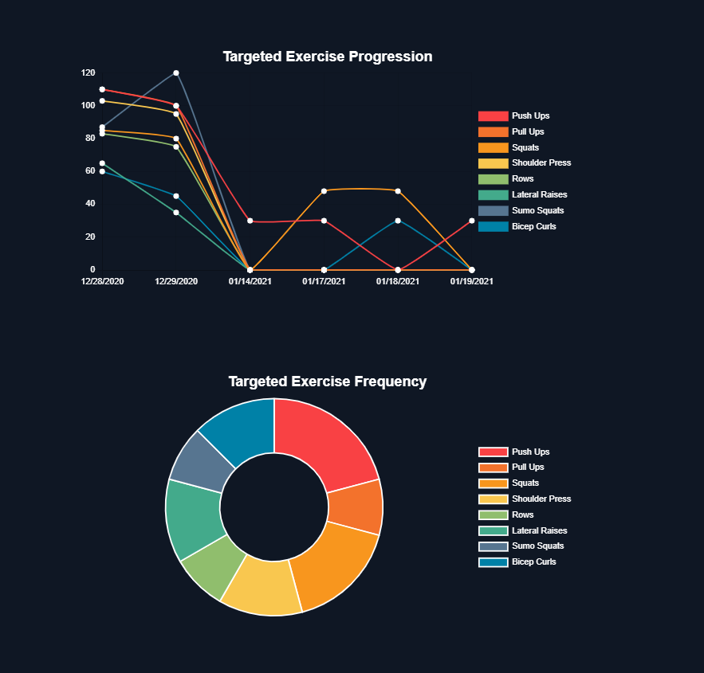</a>
<a href="https://trainer-hub.herokuapp.com/">
  <h3 align="center">Trainer Hub</h3></a>


</p>


<!-- TABLE OF CONTENTS -->
<details open="open">
  <summary><h2 style="display: inline-block">Table of Contents</h2></summary>
  <ol>
    <li>
      <a href="#about-the-project">About The Project</a>
      <ul>
        <li><a href="#technical-stack">Technical Stack</a></li>
        <li><a href="#introduction">Introduction</a></li>
        <li><a href="#mvp">MVP</a></li>
      </ul>
    </li>
    <li>
      <a href="#getting-started">Getting Started</a>
      <ul>
        <li><a href="#prerequisites">Prerequisites</a></li>
        <li><a href="#installation">Installation</a></li>
      </ul>
    </li>
    <li><a href="#usage">Usage</a></li>
    <li><a href="#api-frontend">API Frontend</a></li>
    <li><a href="#api-backend">API Backend</a></li>
  </ol>
</details>


<!-- ABOUT THE PROJECT -->
## About The Project
*Home page with today's overview and total client sessions
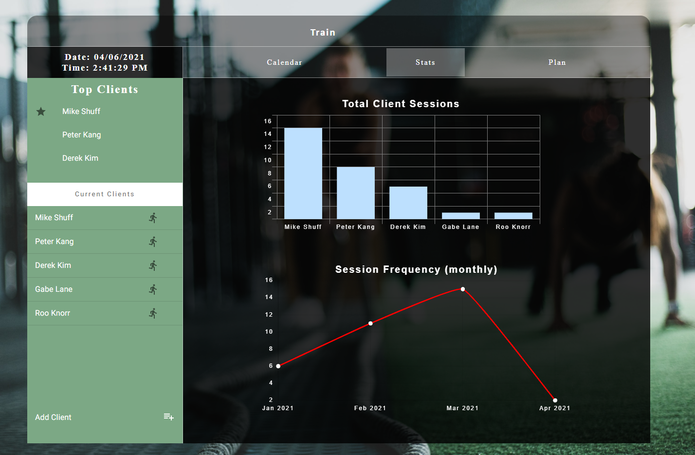

*User can Login with their account.
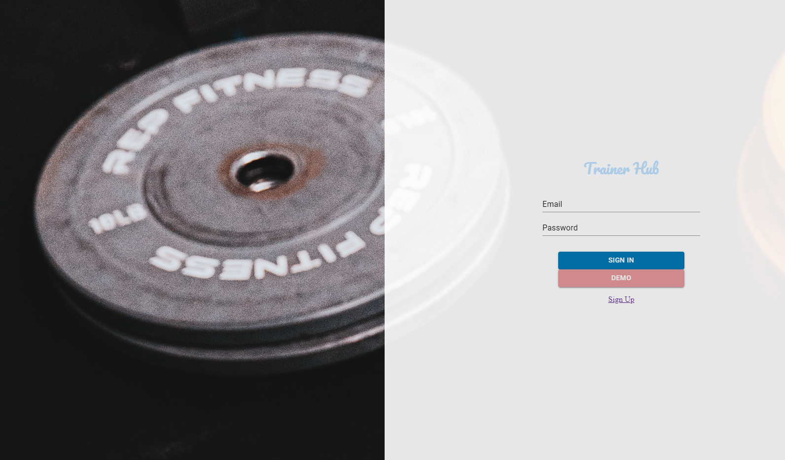

*User can signup as a personal trainer.
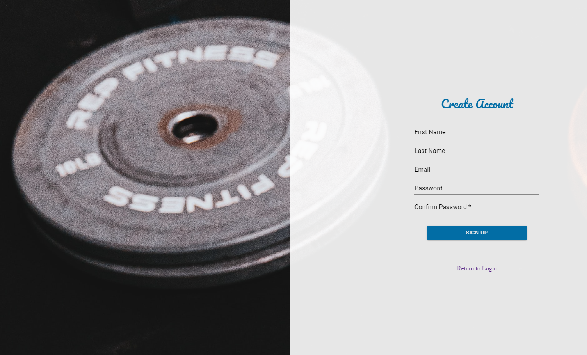

*User can view monthly schedule for easy planning.
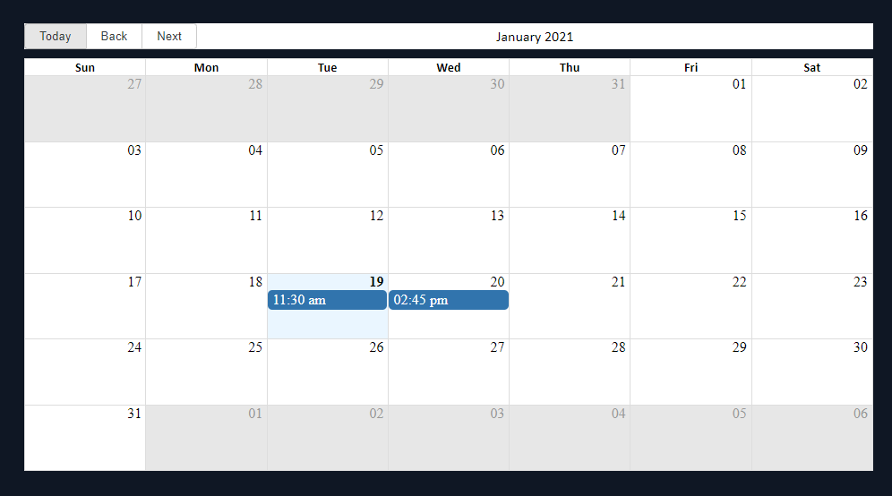

*User can create custom exercises and intensities.
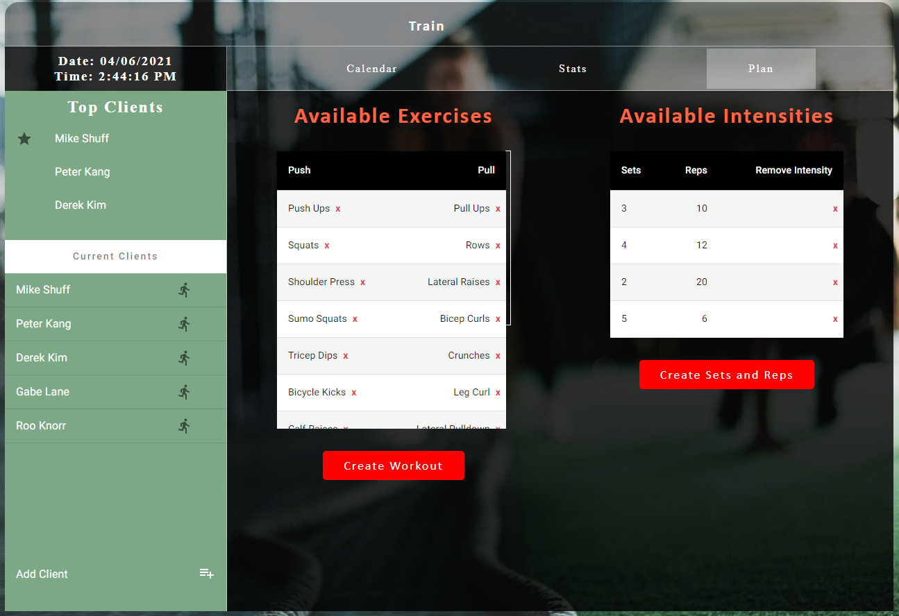

*User can view client contact and payment information.
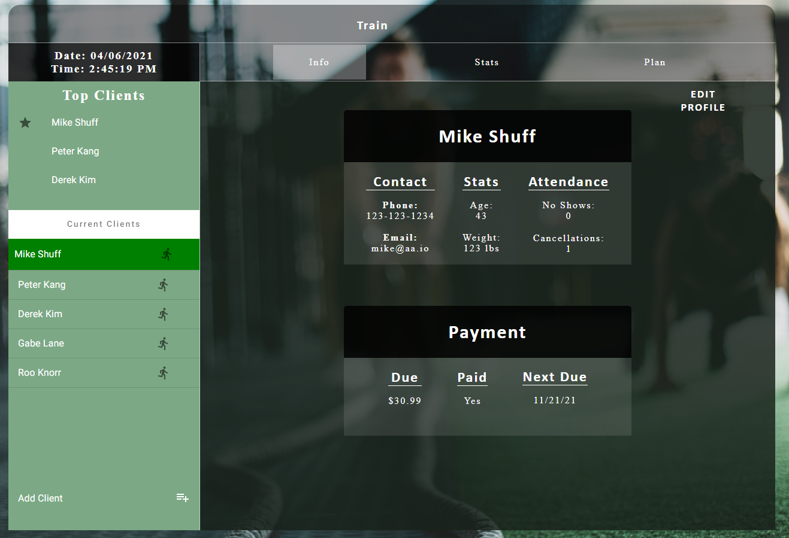

*User can track client progress in targeted exercises.
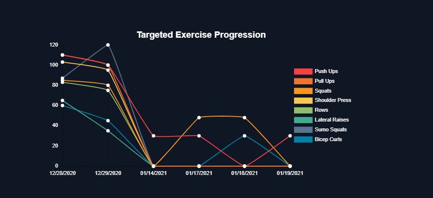

*User can track targeted exercise frequency to balance future workout plans.
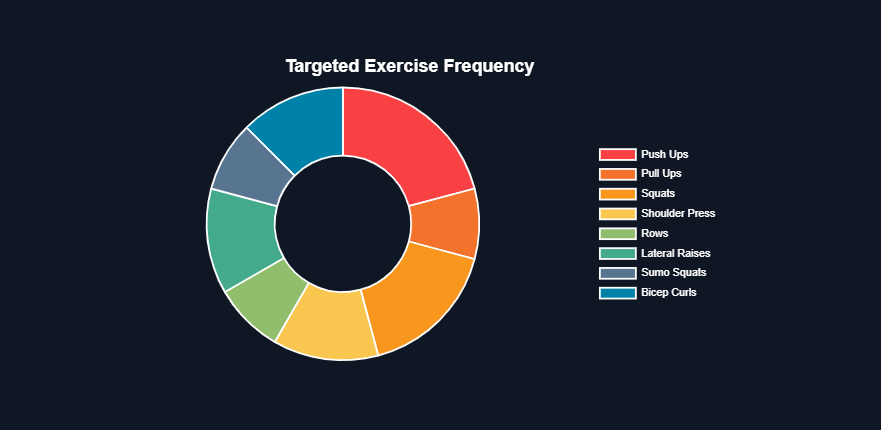

*User can view current workout plans and schedule more.
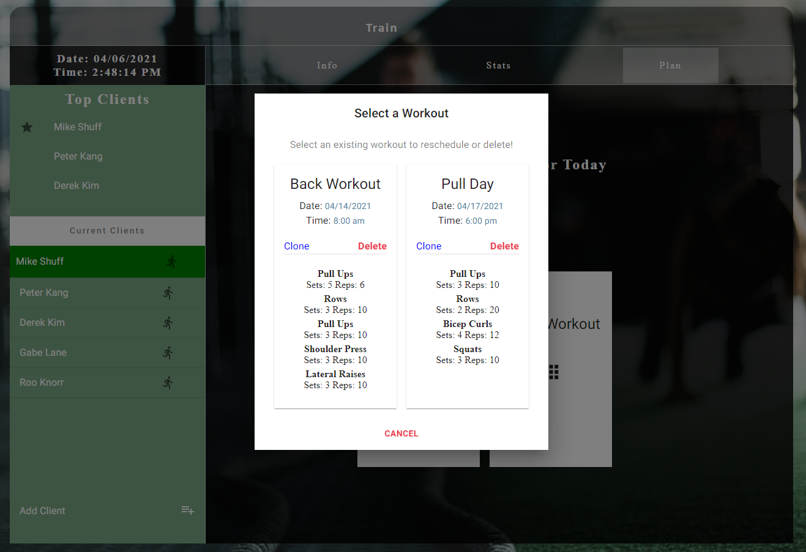
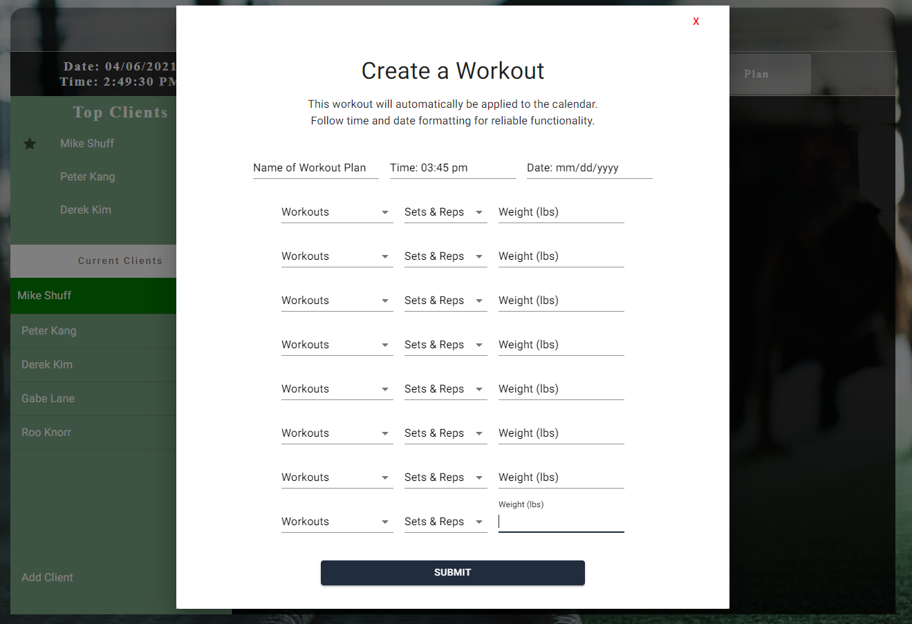

<!-- *Database Schema
 -->


### Technical Stack

* Frontend built with React, Redux, and Node.js.
* Backend built with Flask and PostgreSQL.


### introduction

Trainer Hub is a web app for personal trainers, based around progress tracking and easy customization of client workouts and schedules.


### MVP
the MVP for this website encompasses the following:

1.  Login/Sign-up
    1. Users can login as a demo account.
    2. Users can create account in sign-up page.
2.  Main Page
    1. Shows overview of today and tomorrow's schedules for a quick look.
    2. Shows monthly calendar for easy planning and workout coordination.
    3. Allows for the creation of exercises and intensities which can be used in all client workout plans.
3. Progress Tracking
    1. Statistical representation of targeted exercises makes it easy to view client progress over time.
    2. Pie chart of exercise frequency makes over-training or under-training of specific exercises/muscle groups easily visible.
4. Workout Plans
    1. Users can schedule workout plans using the list of exercises and intensities available in the main page.
    2. All workout plans require date and time input and are immediately reflected in the monthly calendar.
    3. If a workout plan is scheduled for the current day it will show the routine for quick reference.


<!-- GETTING STARTED -->
## Getting Started
-----------

To get a local copy up and running follow these simple steps.

### Prerequisites

Express, react, s3...

### Installation


1. Clone the repo
   ```sh
   git clone https://github.com/ransonk/client_manager
   ```
2. Install NPM packages
   ```sh
   npm install
   ```
3. Create your postgres database and connect it to the app.

4. On the root directory to run frontend and backend
   ```sh
   npm start
   ```
5. browse to http://locahost:3000.


<!-- USAGE EXAMPLES -->
## Usage
-----------
Users can schedule client workouts, view progress of targeted exercises and manage client information.


## API Frontend
--------------------------
|    Path            |   HTTP Verb   |          Meaning                   |
|--------------------|---------------|------------------------------------|
|         /          |      GET      |       Show main page               |
|         /          |      POST     |      search restaurants            |
| /manage-client     |      GET      |      Show client page              |
|       /log-in      |      POST     |         logs in user               |
|      /sign-up      |      GET      |      show a sign-up form           |
|      /sign-up      |      POST     |      creates a new user            |


--------------------------

## API Backend
-----------
|                Path                 | HTTP Verb |                      Meaning                           |
|-------------------------------------|-----------|--------------------------------------------------------|
| /api/auth/login                     |   POST    |                   logs in user                         |
| /api/auth/signup                    |   POST    |                   creates user account                 |
| /api/trainers/                      |   GET     |            gets user for user profile                  |
| /api/trainers/s-clients             |   GET     |            gets trainer clients excl. sensitive info   |
| /api/trainers/id/create-client      |   POST    |            creates client account                      |
| /api/trainers/delete-client/id      |   DELETE     |         deletes client account    |
| /api/trainers/client/id/update      |   GET     |            gets client information                     |
| /api/trainers/client/id/update      |   PUT     |            updates client information                  |
| /api/trainers/client/id/todays-clients |   GET     |         gets clients with workout scheduled for today |
| /api/trainers/client/id/workout-plans  |   GET     |         gets all customized client workout plans      |
| /api/trainers/id/workout-plans  |   GET     |         gets all workout plans                             |
| /api/trainers/client/id/create-workout-plan  |   POST     |         creates customized client workout plan     |
| /api/trainers/delete-workout-plan/id  |   DELETE     |         deletes workout plan    |
| /api/trainers/id/create-workout  |   POST     |         creates custom exercise    |
| /api/trainers/delete-workout/id  |   DELETE     |         deletes exercise    |
| /api/trainers/id/create-intensity  |   POST     |         creates custom intensity    |
| /api/trainers/client/id/delete-intensity  |   DELETE     |         deletes intensity    |
| /api/trainers/id/workout-history |   GET     |         gets historical data of all scheduled exercises |
| /api/trainers/client/id/create-workout-history  |   POST     |         creates record of scheduled exercises     |
| /api/trainers/id/workouts           |   GET     |            gets list of customized exercises           |
| /api/trainers/id/intensities        |   GET   |            gets list of customized intensities           |


[linkedin-shield]: https://img.shields.io/badge/-LinkedIn-black.svg?style=for-the-badge&logo=linkedin&colorB=555
[linkedin-url-ranson]:https://www.linkedin.com/in/ranson-knorr-b132391b7/
